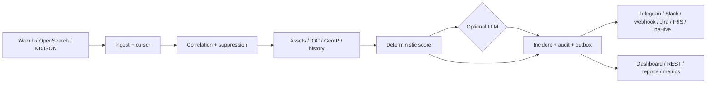

# SIEM Triage Agent

Core is licensed under Apache-2.0. See [LICENSE](LICENSE).

Community core: NDJSON ingest, deduplication, 15-minute correlation, deterministic scoring, CLI, health API and a non-root container.

## Architecture

## How it compares

| Option | Best fit | Triage correlation and feedback | Self-hosted delivery |
| --- | --- | --- | --- |
| SIEM Triage Agent Community | Small SOCs and lab-to-production pilots | Built-in deterministic score, optional LLM, TP/FP/Ack feedback | Single Go binary, Docker, Helm |
| SIEM-native rules only | Teams needing basic filtering | Rules and suppression, limited incident feedback loop | Depends on the SIEM deployment |
| Generic SOAR | Mature SOC orchestration | Broad playbooks, heavier integration and operations | Usually a larger platform |

The table describes scope differences, not a claim that this project replaces a full SIEM or SOAR platform.

Quick start:

    go run . run --file testdata/example.ndjson --db data/triage.db
    go test ./...
    docker compose up --build
    helm upgrade --install triage deploy/helm/siem-triage-agent
    go run . report --db data/triage.db --period 7d --format md --out weekly.md
    go run . report --db data/triage.db --period 7d --format pdf --out weekly.pdf
    go run . report --db data/triage.db --period 7d --format docx --out weekly.docx
    go run . rules test --file testdata/example.ndjson --config config.yaml
    go run . feedback export --db data/triage.db --out feedback.jsonl
    go run . apikey create --db data/triage.db --name soc-bot --role analyst

LLM is opt-in. For an OpenAI-compatible endpoint set `--llm-url` and `--llm-model`; use `--llm-api-key-env` to name an environment variable for the key. Without `--llm-url`, the run is rule-only and makes no outbound request.

`docker compose up --build` starts the self-contained demo: it loads `testdata/example.ndjson` into the named SQLite volume and then serves the dashboard/API on port 8080. To reset demo data, run `docker compose down -v`.

The repeatable PowerShell smoke check is `./scripts/compose-smoke.ps1`; it builds the image, verifies `/health`, `/stats`, and that demo incidents were loaded, then removes the temporary container, network, and volume.

For a repeatable local performance check, run `task benchmark` (or the equivalent `go test -run '^$' -bench '^BenchmarkGroup100k$' -benchtime=1x -count=1`). The benchmark processes 100,000 alerts through sorting and correlation; record the host and result when evaluating the 500-alerts/second production target.

If host port 8080 is occupied, use `TRIAGE_PORT=18080 docker compose up --build` (PowerShell: `$env:TRIAGE_PORT=18080; docker compose up --build`).

The server also serves a small HTML dashboard at `/`, with `/stats`, `/assets` and `/suppressions` views, OpenAPI JSON at `/openapi.json`, and Prometheus metrics at `/metrics`. API endpoints are `GET /health`, `GET /api/incidents` (optional `severity`, `since`, `limit` filters), `GET /api/incidents/{id}`, `GET /api/stats`, `GET /api/assets`, `POST /api/incidents/feedback`, and suppression CRUD under `/api/suppressions`. Suppression POST accepts either a legacy `fingerprint` or a structured `match` (`rule_id`, `src_ip` CIDR/glob, `description` regex, `groups`, `agent_id`). Protected API routes have a per-client rate limit. Telegram and Slack callbacks are accepted at `/api/integrations/telegram/callback` and `/api/integrations/slack/callback`; set `--webhook-secret-env TRIAGE_WEBHOOK_SECRET` for the shared-secret demo path, or set `--slack-signing-secret-env SLACK_SIGNING_SECRET` to enforce Slack's native timestamped HMAC signature. Set `--source-url` to enable continuous Wazuh/OpenSearch polling (with `--source-index`, optional basic auth flags, and a persistent SQLite cursor); add `--webhook-url` for the generic HMAC channel. Additional Telegram, Slack, IRIS, TheHive and Jira channels can be enabled under `notify:` in YAML; each gets its own idempotent outbox record and retry lifecycle. Set `--api-key-env TRIAGE_API_KEY` for an environment key and `--api-key-role viewer|analyst|admin` to scope it, or create a database key with `triage apikey create`; once an active DB key exists, protected API routes require `Authorization: Bearer ...`. Health and metrics remain public for probes. For TLS, pass both `--tls-cert` and `--tls-key`.
