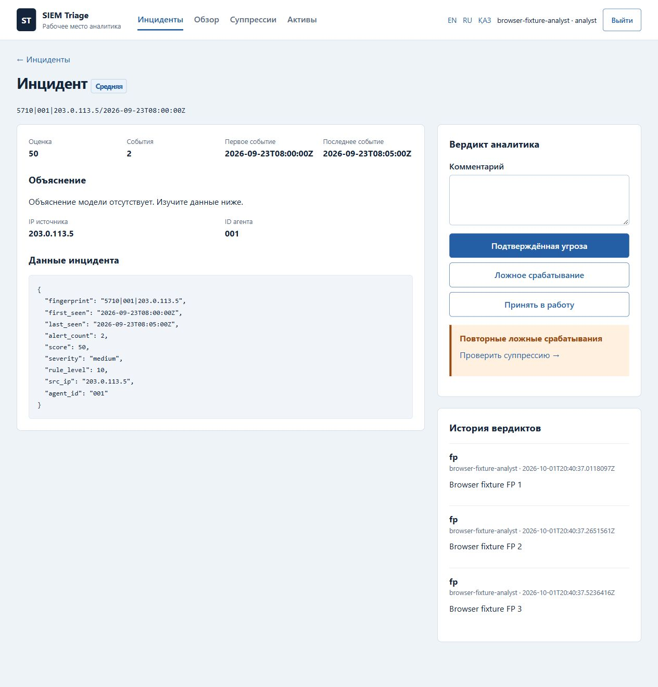
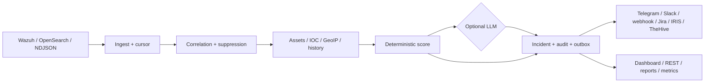

# SIEM Triage Agent

Core is licensed under Apache-2.0. See [LICENSE](LICENSE).

Community core: NDJSON ingest, deduplication, 15-minute correlation, deterministic scoring, CLI, health API and a non-root container.



## Architecture


```mermaid
flowchart LR
  S[Wazuh / OpenSearch / NDJSON] --> I[Ingest + cursor]
  I --> C[Correlation + suppression]
  C --> E[Assets / IOC / GeoIP / history]
  E --> T[Deterministic score]
  T --> L{Optional LLM}
  L --> O[Incident + audit + outbox]
  T --> O
  O --> N[Telegram / Slack / webhook / Jira / IRIS / TheHive]
  O --> U[Dashboard / REST / reports / metrics]
```

## How it compares

| Option | Best fit | Triage correlation and feedback | Self-hosted delivery |
| --- | --- | --- | --- |
| SIEM Triage Agent Community | Small SOCs and lab-to-production pilots | Built-in deterministic score, optional LLM, TP/FP/Ack feedback | Single Go binary, Docker, Helm |
| SIEM-native rules only | Teams needing basic filtering | Rules and suppression, limited incident feedback loop | Depends on the SIEM deployment |
| Generic SOAR | Mature SOC orchestration | Broad playbooks, heavier integration and operations | Usually a larger platform |

The table describes scope differences, not a claim that this project replaces a full SIEM or SOAR platform.

Quick start:

    go run . run --file testdata/example.ndjson --db data/triage.db
    go test ./...
    docker compose up --build
    helm upgrade --install triage deploy/helm/siem-triage-agent
    go run . report --db data/triage.db --period 7d --format md --out weekly.md
    go run . report --db data/triage.db --period 7d --format pdf --out weekly.pdf
    go run . report --db data/triage.db --period 7d --format docx --out weekly.docx
    go run . rules test --file testdata/example.ndjson --config config.yaml
    go run . feedback export --db data/triage.db --out feedback.jsonl
    go run . apikey create --db data/triage.db --name soc-bot --role analyst

LLM is opt-in. For an OpenAI-compatible endpoint set `--llm-url` and `--llm-model`; use `--llm-api-key-env` to name an environment variable for the key. Without `--llm-url`, the run is rule-only and makes no outbound request.

`docker compose up --build` starts the self-contained demo: it loads `testdata/example.ndjson` into the named SQLite volume and then serves the dashboard/API on port 8080. To reset demo data, run `docker compose down -v`.

The repeatable PowerShell smoke check is `./scripts/compose-smoke.ps1`; it builds the image, verifies `/health`, `/stats`, and that demo incidents were loaded, then removes the temporary container, network, and volume.

For a repeatable local performance check, run `task benchmark` (or the equivalent `go test -run '^$' -bench '^BenchmarkGroup100k$' -benchtime=1x -count=1`). The benchmark processes 100,000 alerts through sorting and correlation; record the host and result when evaluating the 500-alerts/second production target.

If host port 8080 is occupied, use `TRIAGE_PORT=18080 docker compose up --build` (PowerShell: `$env:TRIAGE_PORT=18080; docker compose up --build`).

The server serves an analyst console at `/`, with incident detail, TP/FP/Ack feedback, suppression creation/deletion, assets and dashboard views. Templates and CSS/JavaScript are embedded; the runtime needs neither Node nor a CDN. See [acceptance evidence](docs/acceptance.md) and [remaining work](TODO.md) for the full TZ boundary.

## Browser access and roles

Create a key with `triage apikey create --db data/triage.db --name analyst --role analyst`, then run `triage serve --db data/triage.db`. Open the server URL and enter the issued key on the login page. Treat this one-time key output as a secret; do not commit it. An environment key is also supported with `--api-key-env TRIAGE_API_KEY --api-key-role viewer|analyst|admin`.

Without configured keys the server is an explicitly labelled, open demo. Configure a key and TLS before exposing it outside a trusted local environment. Once a DB key has existed, revoking every key leaves authentication required; create or rotate a key using the CLI to regain access. Browser sessions expire after eight hours and on logout/restart. API clients still use `Authorization: Bearer ...`; browser cookies do not authenticate API calls.

| Role | Read incidents and rules | Submit verdict or create rule | Delete rule |
| --- | --- | --- | --- |
| viewer | Yes | No | No |
| analyst | Yes | Yes | No |
| admin | Yes | Yes | Yes |

UI language defaults to `triage.language` (en/ru/kk; kz is an alias). EN/RU/ҚАЗ links select a browser preference. Dashboard filters apply to incident counts and top sources/tactics; feedback, MTTA and delivery metrics remain clearly labelled all-time.

Use built-in TLS with both `--tls-cert` and `--tls-key`. Behind a TLS-terminating proxy set `--web-public-url https://triage.example.com` and restrict direct backend access. This explicit origin controls CSRF checks and Secure cookies; forwarded headers are not trusted to choose it. Health, metrics and OpenAPI remain public; restrict them at the deployment boundary when appropriate.

## API and integrations

API endpoints include `GET /api/incidents` (severity/since/limit), `GET /api/incidents/{id}`, `GET /api/stats`, `GET /api/assets`, `POST /api/incidents/feedback`, and suppression CRUD under `/api/suppressions`. Percent-encode composite incident IDs as a single path segment. Suppression POST accepts a legacy `fingerprint` or structured `match` (rule_id, src_ip CIDR/glob, description regex, groups, agent_id), plus action, reason and optional future RFC3339 `expires_at`. Actor/created_by values supplied by a client cannot override the authenticated audit identity. API/UI requests have bounded per-client rate limiting.

Telegram/Slack callbacks use `/api/integrations/telegram/callback` and `/api/integrations/slack/callback`. Configure `--webhook-secret-env TRIAGE_WEBHOOK_SECRET`, or `--slack-signing-secret-env SLACK_SIGNING_SECRET` for Slack signature verification. Continuous Wazuh/OpenSearch polling uses `--source-url`, `--source-index`, basic-auth environment flags and a persistent cursor; `--webhook-url` enables generic HMAC delivery. Telegram, Slack, IRIS, TheHive and Jira channels are configurable under `notify:` and use separate durable outbox records. Real vendor/customer acceptance is still pending.

## Rebuilding the interface

Checked-in generated templates and assets allow `go build` or Docker builds without frontend tools. After editing UI sources, run `task ui`, or:

```sh
npm ci --ignore-scripts
npm run vendor:htmx
npm run build:css
go run github.com/a-h/templ/cmd/templ@v0.3.1020 generate -path internal/web
```

The module requires Go 1.25 or newer; CI/container builds use Go 1.26.
